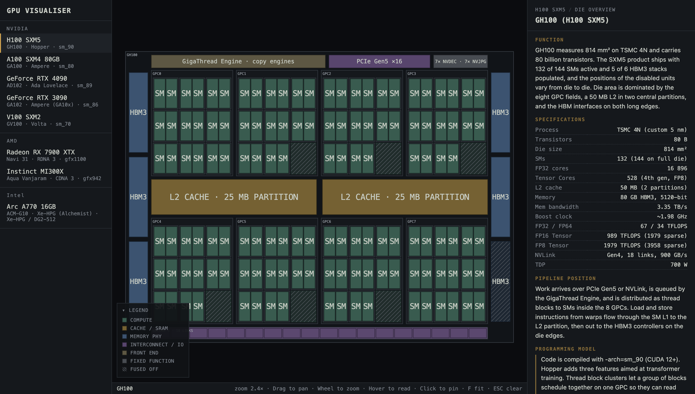
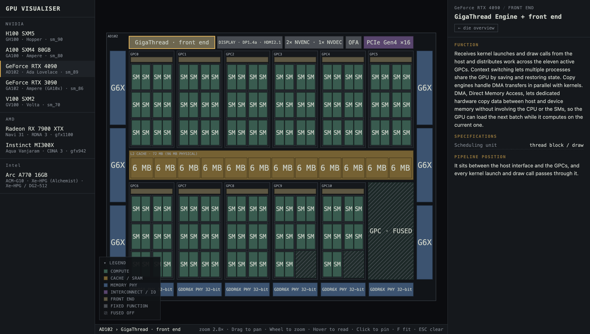

# GPU-Visualiser
[This README was written by a human]

A tool to visualise GPU architectures.

Access here: [https://madhavmenon10.github.io/GPU-Visualiser/](https://madhavmenon10.github.io/GPU-Visualiser/)

## Note

Every floorplan is built from the vendor's own published architecture. Units shown as hatched blocks are *fused off* i.e. permanently disabled at the factory by blowing tiny on-chip fuses, so a die with a manufacturing defect in that region can still be sold rather than scrapped. This is why a shipping part often has fewer active cores than the full die. This is also covered within the tool.

## Screenshots

The die overview, with the whole floorplan in view and the legend mapping colours to block types:



Click a block to pin it and read its documentation. Here the GigaThread Engine on the NVIDIA GeForce RTX 4090 is selected:



## Supported GPUs

Each entry cites the sources its data is drawn from. The numbers map to the [References](#references) section.

### NVIDIA

| GPU | Die | Architecture | ISA | Process | Sources |
| --- | --- | --- | --- | --- | --- |
| H100 SXM5 | GH100 | Hopper | sm_90 | TSMC 4N | [[1]](https://resources.nvidia.com/en-us-tensor-core/gtc22-whitepaper-hopper), [[9]](https://www.techpowerup.com/gpu-specs/) |
| A100 SXM4 80GB | GA100 | Ampere | sm_80 | TSMC N7 | [[2]](https://images.nvidia.com/aem-dam/en-zz/Solutions/data-center/nvidia-ampere-architecture-whitepaper.pdf), [[9]](https://www.techpowerup.com/gpu-specs/) |
| GeForce RTX 4090 | AD102 | Ada Lovelace | sm_89 | TSMC 4N | [[3]](https://images.nvidia.com/aem-dam/Solutions/geforce/ada/nvidia-ada-gpu-architecture.pdf), [[9]](https://www.techpowerup.com/gpu-specs/) |
| GeForce RTX 3090 | GA102 | Ampere (GA10x) | sm_86 | Samsung 8N | [[4]](https://www.nvidia.com/content/PDF/nvidia-ampere-ga-102-gpu-architecture-whitepaper-v2.1.pdf), [[9]](https://www.techpowerup.com/gpu-specs/) |
| V100 SXM2 | GV100 | Volta | sm_70 | TSMC 12FFN | [[5]](https://images.nvidia.com/content/volta-architecture/pdf/volta-architecture-whitepaper.pdf), [[9]](https://www.techpowerup.com/gpu-specs/) |

### AMD

| GPU | Die | Architecture | ISA | Process | Sources |
| --- | --- | --- | --- | --- | --- |
| Radeon RX 7900 XTX | Navi 31 | RDNA 3 | gfx1100 | TSMC N5 + N6 | [[6]](https://gpuopen.com/news/rdna3-isa-guide-now-available/), [[9]](https://www.techpowerup.com/gpu-specs/) |
| Instinct MI300X | Aqua Vanjaram | CDNA 3 | gfx942 | TSMC N5 + N6 | [[7]](https://www.amd.com/content/dam/amd/en/documents/instinct-tech-docs/white-papers/amd-cdna-3-white-paper.pdf), [[9]](https://www.techpowerup.com/gpu-specs/) |

### Intel

| GPU | Die | Architecture | ISA | Process | Sources |
| --- | --- | --- | --- | --- | --- |
| Arc A770 16GB | ACM-G10 | Xe-HPG (Alchemist) | Xe-HPG / DG2-512 | TSMC N6 | [[8]](https://cdrdv2-public.intel.com/758302/introduction-to-the-xe-hpg-architecture-white-paper.pdf), [[9]](https://www.techpowerup.com/gpu-specs/) |

## Build and run

The project is a [Vite](https://vitejs.dev) + React + TypeScript app. You need Node.js 18 or newer.

```bash
# install dependencies
npm install

# start the dev server (hot reload) at http://localhost:5173
npm run dev

# type-check and produce a production build in dist/
npm run build

# serve the production build locally
npm run preview
```

## Contributing

See [CONTRIBUTING.md](https://github.com/MadhavMenon10/GPU-Visualiser?tab=contributing-ov-file)

## References

Architecture descriptions come primarily from each vendor's own whitepaper or instruction-set documentation. Die area, transistor counts and clock speeds, where the whitepaper does not state them, are taken from the TechPowerUp GPU Database.

1. NVIDIA — [NVIDIA H100 Tensor Core GPU Architecture (Hopper whitepaper)](https://resources.nvidia.com/en-us-hopper-architecture/nvidia-h100-tensor-c). See also the [Hopper Architecture In-Depth](https://developer.nvidia.com/blog/nvidia-hopper-architecture-in-depth/) technical blog.
2. NVIDIA — [NVIDIA A100 Tensor Core GPU Architecture (Ampere whitepaper)](https://images.nvidia.com/aem-dam/en-zz/Solutions/data-center/nvidia-ampere-architecture-whitepaper.pdf).
3. NVIDIA — [NVIDIA Ada GPU Architecture whitepaper](https://images.nvidia.com/aem-dam/Solutions/geforce/ada/nvidia-ada-gpu-architecture.pdf).
4. NVIDIA — [NVIDIA Ampere GA102 GPU Architecture whitepaper](https://www.nvidia.com/content/PDF/nvidia-ampere-ga-102-gpu-architecture-whitepaper-v2.1.pdf).
5. NVIDIA — [NVIDIA Tesla V100 GPU Architecture (Volta whitepaper)](https://images.nvidia.com/content/volta-architecture/pdf/volta-architecture-whitepaper.pdf).
6. AMD — [RDNA 3 Instruction Set Architecture Reference Guide](https://gpuopen.com/news/rdna3-isa-guide-now-available/) and the [Radeon RX 7900 XTX product page](https://www.amd.com/en/products/graphics/desktops/radeon/7000-series/amd-radeon-rx-7900xtx.html).
7. AMD — [AMD CDNA 3 Architecture white paper](https://www.amd.com/content/dam/amd/en/documents/instinct-tech-docs/white-papers/amd-cdna-3-white-paper.pdf) and the [AMD Instinct MI300 series microarchitecture](https://rocm.docs.amd.com/en/latest/conceptual/gpu-arch/mi300.html) (ROCm documentation).
8. Intel — [Introduction to the Xe-HPG Architecture white paper](https://cdrdv2-public.intel.com/758302/introduction-to-the-xe-hpg-architecture-white-paper.pdf) and the [Intel Arc A770 Graphics (16GB) product specifications](https://www.intel.com/content/www/us/en/products/sku/229151/intel-arc-a770-graphics-16gb/specifications.html).
9. TechPowerUp — [GPU Database](https://www.techpowerup.com/gpu-specs/), secondary source for die area, transistor counts and clock speeds.
